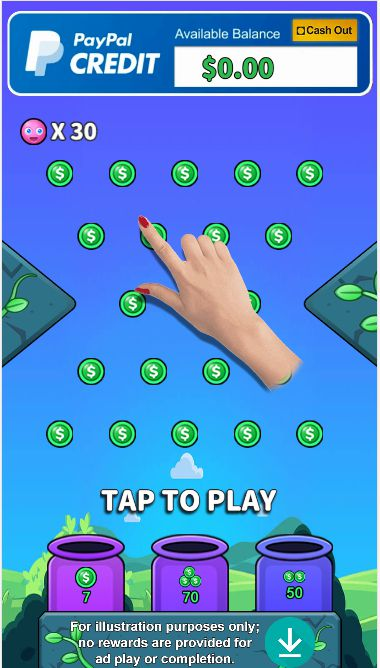
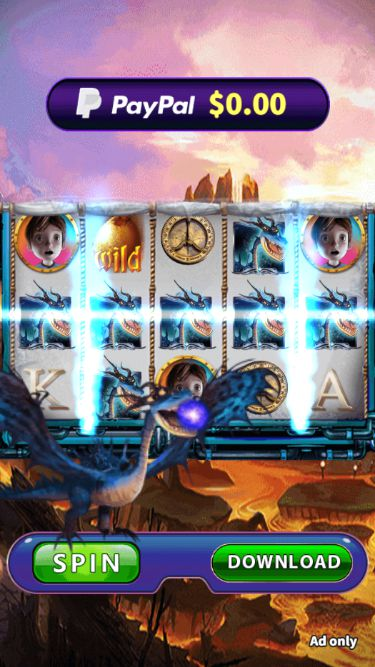

# Playable Ads Practice

What are playable Ads ?

Playable ads work as a “try before you download” type ad unit, letting users interact with an app’s main features before installing it. 

Why playable ads?

HTML5 interactive ads are great for immersing your audience and reducing churn rates

什么是可玩广告？

可玩广告是一种“先试用后下载”的广告形式，让用户在安装应用程序之前与应用程序的主要功能进行交互。

为什么需要可玩广告？

H5互动广告非常适合让观众沉浸其中，降低流失率。

### PixiJS - Practice  
 
github io: [PlinkoMaster](https://ohmango.github.io/PlinkoMaster/) Alternate links: [PlinkoMaster](https://tplayable.s3.ap-east-1.amazonaws.com/test/caoyuquan/cyqPM.html) 

[SpinforCash](https://ohmango.github.io/SpinforCash/IceDragon/) 

